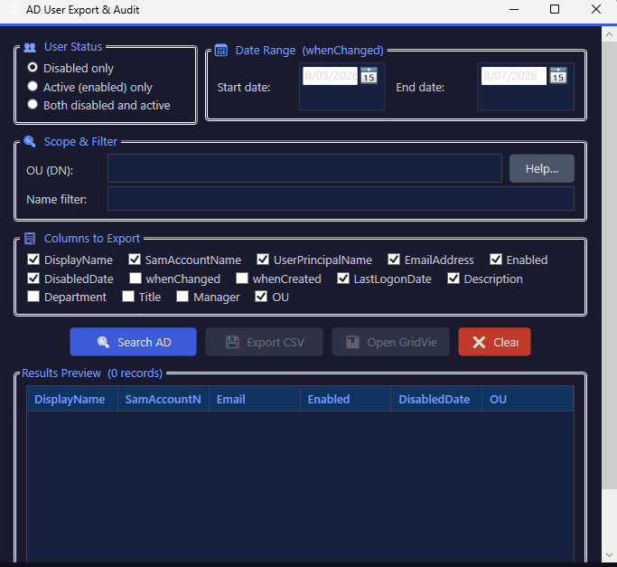

# AD User Export & Audit

AD User Export & Audit is a PowerShell WPF GUI tool for exporting and auditing Active Directory user accounts by status (disabled, active, or both) within a selected date range. It uses `Get-ADUser` with the `whenChanged` attribute to build CSV reports, with options for OU scoping, name filters, column selection, and live preview. The tool is designed to make leaver audits and account reviews faster and more consistent, without needing to write raw PowerShell commands.

> Note: The date filter uses `whenChanged` as an approximate “disabled on” or “changed on” date. Active Directory does not store a dedicated “disabled date” field; using `whenChanged` is a common reporting approach.

---

## Features

- Dark-themed WPF GUI for a more comfortable admin experience.
- Date range selection based on the `whenChanged` attribute.
- Filter by user status:
  - Disabled only
  - Active (enabled) only
  - Both disabled and active
- Optional scope and filters:
  - SearchBase / OU (Distinguished Name)
  - DisplayName wildcard filter (e.g. `John*`)
- Selectable columns to export (DisplayName, SamAccountName, UPN, Email, Enabled, DisabledDate, LastLogonDate, OU, etc.).
- Results preview grid to inspect data before exporting.
- Export options:
  - CSV export with `Export-Csv`
  - Out-GridView for interactive viewing in PowerShell.

---

## Requirements

- Windows with PowerShell 5.1.
- RSAT / **ActiveDirectory** module installed (for `Get-ADUser`).
- Network connectivity and read access to your Active Directory domain.

---

## Installation

1. Clone the repository:

   ```bash
   git clone https://github.com/aliriaz-ops/AD-User-Export-Audit.git
   cd AD-User-Export-Audit
   ```

2. Ensure RSAT / ActiveDirectory module is installed on the machine where you run the tool.

3. (Optional) Add the script folder to your PATH or create a shortcut for easier launching.

---

## Usage

### Run the PowerShell script

From the project folder:

```powershell
.\ADUserExportAudit.ps1
```

Then in the GUI:

1. Select **User status**:
   - Disabled only
   - Active (enabled) only
   - Both disabled and active
2. Select a **date range** (based on `whenChanged`).
3. Optionally:
   - Enter an OU Distinguished Name (SearchBase), e.g. `OU=Users,DC=corp,DC=local`.
   - Enter a DisplayName wildcard filter, e.g. `John*`.
4. Click **Search AD** to query and populate the preview grid.
5. Review the results:
   - Use the preview grid to scan users and columns.
6. Choose an output:
   - Click **Export CSV** to save the results to a CSV file.
   - Click **Open GridView** to view the results in `Out-GridView` for interactive filtering and sorting.

### Compile to EXE with PS2EXE (optional)

If you prefer a standalone application:

```powershell
Invoke-PS2EXE -InputFile .\ADUserExportAudit.ps1 `
              -OutputFile .\ADUserExportAudit.exe `
              -NoConsole
```

You can also supply an `.ico` file for a custom icon:

```powershell
Invoke-PS2EXE -InputFile .\ADUserExportAudit.ps1 `
              -OutputFile .\ADUserExportAudit.exe `
              -NoConsole `
              -IconFile .\youricon.ico
```

> Note: `-IconFile` must reference a valid `.ico` file, not `.png`.

---

## Screenshots

_Main window (example):_



---

## Roadmap / Ideas

Planned or possible future improvements include:

- HTML or Excel report output with summary statistics.
- Event log–based “disabled date” reporting using DC security logs (Event ID 4725).
- Additional filters (group membership, inactivity thresholds, departments).
- Optional remediation actions (e.g. move to “Disabled Users” OU, group cleanup).
- Settings profiles for common audit/report scenarios.

---

## Contributing

Contributions, issues, and feature requests are welcome.

- Fork the repository.
- Create a feature branch (`git checkout -b feature/YourFeature`).
- Commit your changes.
- Push the branch and open a Pull Request.

Please include a clear description and, where possible, screenshots or sample outputs when proposing UI or reporting changes.

---

## License

This project is licensed under the **MIT License** – see the [LICENSE](LICENSE) file for details.

By using or contributing to this project, you agree to the terms of the MIT License.
